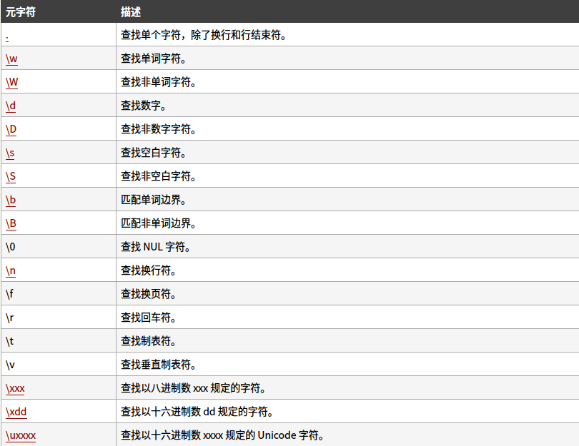
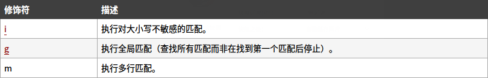

<!-- toc -->
# 正则表达式
正则表达式是用于匹配字符串中字符组合的模式。在 JavaScript中，正则表达式也是对象。这些模式被用于 RegExp 的 exec 和 test 方法, 以及 String 的 match、replace、search 和 split 方法。
## 创建一个正则表达式
两种方法，一种是直接写，由包含在斜杠之间的模式组成；另一种是调用RegExp对象的构造函数。
### 正则表达式直接量语法
如下所示：
```js
/*
   /pattern/flags
*/
const regex = /ab+c/;
//匹配a后面紧跟着多个b，在紧跟着c的字符串
const regex = /^[a-zA-Z]+[0-9]*\W?_$/gi;
```
**优点：** 在加载脚本后，正则表达式字面值提供正则表达式的编译。当正则表达式保持不变时，使用此方法可获得更好的性能。
### 调用RegExp对象的构造函数语法
如下所示：
```js
/*
    new RegExp(pattern [, flags])
*/
let regex = new RegExp("ab+c");

let regex = new RegExp(/^[a-zA-Z]+[0-9]*\W?_$/, "gi");

let regex = new RegExp("^[a-zA-Z]+[0-9]*\W?_$", "gi");
```

**优点：** 使用构造函数，当你知道正则表达式模式将会改变，或者你不知道模式，并从另一个来源，如用户输入。

## 正确编写正则表达式
一个正则表达式模式是由简单的字符所构成的，比如/abc/, 或者是简单和特殊字符的组合，比如 /ab*c/ 或 /Chapter (\d+)\.\d*/。后者用到了括号，它在正则表达式中可以被用作是一个记忆设备。这一部分正则所匹配的字符将会被记住，在后面可以被利用。

### 两种创建表达式都可遵循同一个标准:

1. 只不过直接量语法使用： **/要匹配的规则/接修饰符**

2. 构造函数语法使用：new RegExp(要匹配的规则, "修饰符")

**注意** _构造函数语法比较随性：匹配规则可以当字符串，也可用/ pattern /双反斜杠包裹，最主要可以嵌入变量，匹配一个可以变的正则。_
## 正则表达式中的特殊字符及修饰
### 方括号
方括号用于查找某个范围内的字符：

### 元字符
元字符（Metacharacter）是拥有特殊含义的字符：

### 量词
匹配包含的数量：

### 修饰符

### RegExp 自带方法

#### 1. exec()
检索字符串中指定的值。返回找到的值，并确定其位置。
```js
var str = "hello regexp";
var patt = new RegExp("regexp","g");
patt.exec(str)
//返回值：["regexp", index: 6, input: "hello regexp"]
```
_返回值_

返回一个数组，其中存放匹配的结果。如果未找到匹配，则返回值为 null。
```js
var str = "hello regexp";
var patt = new RegExp("hehe","g");
patt.exec(str)
//返回值：null
```
#### 2. test()
 方法用于检测一个字符串是否匹配某个模式.
```js
var str = "hello regexp";
var patt = new RegExp("regexp","g");
patt.test(str)
//返回值：true
```
_返回值_

如果字符串 string 中含有与 RegExpObject 匹配的文本，则返回 true，否则返回 false。
```js
var str = "hello regexp";
var patt = new RegExp("hehe","g");
patt.test(str)
//返回值：false
```
**注意** 支持正则表达式的 String 对象的方法放在字符串里说。
